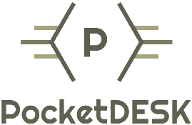
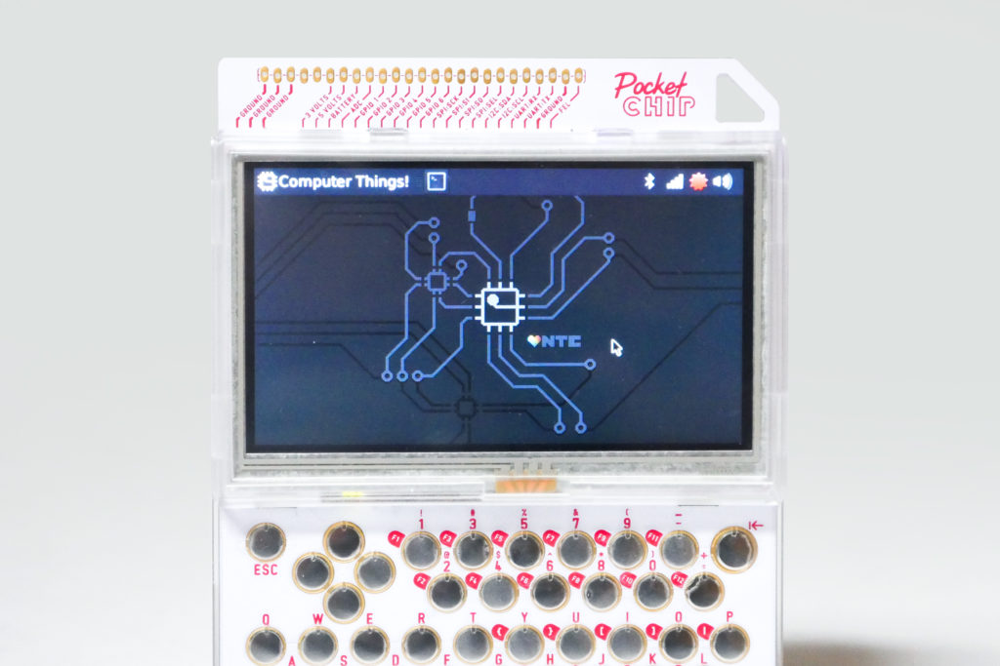

## nytpu's notes:

* you need to be using the chip.jfpossibilities.com repos before running this.
  [see here](http://chip.jfpossibilities.com/chip/debian/)
* **Do not attempt to install this if you're not on Debian Jessie**.  It *will*
  break your system in unpredictable ways.  If you're upgrading a system from
  a fresh flash, install PocketDesk before updating to Stretch/Buster.

----------

# PocketDESK - Unify your PocketCHIP

## A DESKTOP WHEN YOU WANT IT, POCKETHOME WHEN YOU DON’T

Looking for PocketDESKlite? Look here: [PocketDESKlite](PocketDESKlite.md)

----------

## Introducing _**PocketDESK**_

What is _**PocketDESK**_?.

PocketDESK is a way to run the normal _Desktop GUI_ on your _PocketCHIP_ without any hassle. 

_Does the keyboard work?_  **Yes sir**

_Does the touchscreen work?_  **Yes sir**

_Can i run this next to the normal PocketHome?_ **YES SIR**

The install is super simple.

Just run

    sudo apt update && sudo apt install git

    git clone git://git.nytpu.com/forks/PocketDesk

    sudo ./PocketDesk/PocketDESK.sh

That is it. Do a reboot and you are good to go.

----------

## How to use!

The point of **_PocketDESK_** is that you can switch between the normal **Desktop GUI** and **PocketHome**

To do this simply log out of whatever you booted into

**PocketHome:** (_See.. I put a button there for you'all_)

**Desktop:** 

In the login manager you click and choose the desired **GUI** version:

----------

If you run into any problems, feel free ask.

----------

_**Credits:**_ 

_Thank you to @Demonswaltz for testing_

_Thank you to @marshmallow for giving me pointers on PocketHome and creating a better PocketHome_

_And Thanks to the [Slack Communiy](https://slofile.com/slack/chipster)   <- Signup link._

